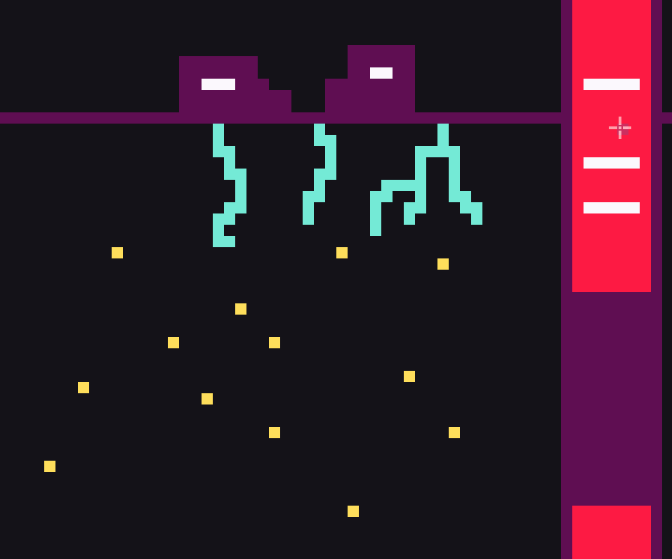

## Procedural Generation Tile Constraints

Procedural generation implementation using constraints.

Based on Model Synthesis by Paul Merrell and Wave Function Collapse by Maxim Gumin.

### Demo
Web: https://proceduralgenerationtileconstraints.pages.dev/

